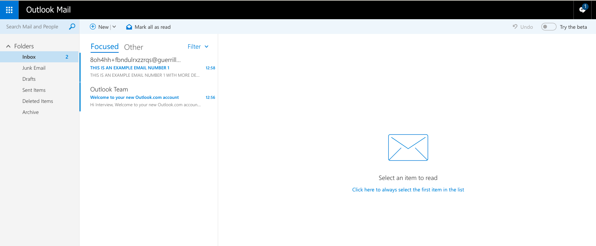

<<<<<<< HEAD
# Getting Started with Create React App

This project was bootstrapped with [Create React App](https://github.com/facebook/create-react-app).

## Available Scripts

In the project directory, you can run:

### `yarn start`

Runs the app in the development mode.\
Open [http://localhost:3000](http://localhost:3000) to view it in the browser.

The page will reload if you make edits.\
You will also see any lint errors in the console.

### `yarn test`

Launches the test runner in the interactive watch mode.\
See the section about [running tests](https://facebook.github.io/create-react-app/docs/running-tests) for more information.

### `yarn build`

Builds the app for production to the `build` folder.\
It correctly bundles React in production mode and optimizes the build for the best performance.

The build is minified and the filenames include the hashes.\
Your app is ready to be deployed!

See the section about [deployment](https://facebook.github.io/create-react-app/docs/deployment) for more information.

### `yarn eject`

**Note: this is a one-way operation. Once you `eject`, you can’t go back!**

If you aren’t satisfied with the build tool and configuration choices, you can `eject` at any time. This command will remove the single build dependency from your project.

Instead, it will copy all the configuration files and the transitive dependencies (webpack, Babel, ESLint, etc) right into your project so you have full control over them. All of the commands except `eject` will still work, but they will point to the copied scripts so you can tweak them. At this point you’re on your own.

You don’t have to ever use `eject`. The curated feature set is suitable for small and middle deployments, and you shouldn’t feel obligated to use this feature. However we understand that this tool wouldn’t be useful if you couldn’t customize it when you are ready for it.

## Learn More

You can learn more in the [Create React App documentation](https://facebook.github.io/create-react-app/docs/getting-started).

To learn React, check out the [React documentation](https://reactjs.org/).

### Code Splitting

This section has moved here: [https://facebook.github.io/create-react-app/docs/code-splitting](https://facebook.github.io/create-react-app/docs/code-splitting)

### Analyzing the Bundle Size

This section has moved here: [https://facebook.github.io/create-react-app/docs/analyzing-the-bundle-size](https://facebook.github.io/create-react-app/docs/analyzing-the-bundle-size)

### Making a Progressive Web App

This section has moved here: [https://facebook.github.io/create-react-app/docs/making-a-progressive-web-app](https://facebook.github.io/create-react-app/docs/making-a-progressive-web-app)

### Advanced Configuration

This section has moved here: [https://facebook.github.io/create-react-app/docs/advanced-configuration](https://facebook.github.io/create-react-app/docs/advanced-configuration)

### Deployment

This section has moved here: [https://facebook.github.io/create-react-app/docs/deployment](https://facebook.github.io/create-react-app/docs/deployment)

### `yarn build` fails to minify

This section has moved here: [https://facebook.github.io/create-react-app/docs/troubleshooting#npm-run-build-fails-to-minify](https://facebook.github.io/create-react-app/docs/troubleshooting#npm-run-build-fails-to-minify)
=======
## Interview Assignment

<hr>

### E-mail Client

The goal of this assignment is to build a prototype email client.



To see an example: Login to https://outlook.live.com/.

The following pages have more details. Please read through the entire document for all the details.

<hr>

### Features

1. The email client can have multiple mail folders
2. We assume the following mail folders to be present
   1. Inbox
   2. Spam
   3. Deleted Items
   4. Custom Folder
3. The **starting data** of this application can be assumed to come from a JSON file
4. As an example, 2 JSON file has been given to you. **You can create rest of the json yourself.**
   1. inbox.json
   2. spam.json
5. Each of the element in the JSON file represents a mail
   1. **subject**: The mail subject which is a string
   2. **content**: The mail content which is a string and can contain html.
   3. **mId**: The mail Id of this mail which can be assumed to be unique Guid string
   4. **unread**: boolean
6. The client should have the following features
   1. When the app starts, the app loads the contents of each folder and displays the unread counts.
   2. User can move around within the app to Inbox, Spam and Custom Folder
   3. User can select any mail and look into the contents
   4. User can see a brief preview before clicking on it.
   5. User can delete a message. In which case it should come in deleted items
   6. User can flag a message.
   7. User can filter on inbox on whether a message is flagged or not.
   8. State, navigation should be saved between refreshes
   9. Back button should work.
7. **fork** current problem repository. and make your forked repository **private**.
8. Add `@bhar4t`, `@divich` as collaborator while intializing repository in github. and follow the given timeline instructions from your mail.

<hr>

### Coding Guidelines

- For design ideas and functionality: Please look at https://outlook.live.com/
- Please avoid any frameworks and libraries except react and mobx.
- Focus more on the JavaScript side of the problem.
- You will be evaluated on
  - UI & design
  - Modularity of Code
  - Data Structures used
  - Logic and cleanliness of code.
  - Completeness.

<hr>

> inbox.json

```json
[
  {
    "mId": "guid-1",
    "unread": true,
    "subject": "Training Program",
    "content": "About Microsoft Virtual Academy<br/>Microsoft Virtual Academy provides free online training by world-class experts to help you build your technical skills and advance your career. Make it your destination of choice to get started on the latest Microsoft technologies and join this vibrant community."
  },
  {
    "mId": "guid-2",
    "unread": false,
    "subject": "Empower your future",
    "content": "We foster our pipeline of future leaders with 47 employee networks and 7 global employee resource groups, servicing an active community of thousands across Microsoft"
  }
]
```

> spam.json

```json
[
  {
    "mId": "guid-3",
    "unread": true,
    "subject": "Pre Approved Loan",
    "content": "Congratulations ! <u>Credit card<u> is being shipped to you today!"
  },
  {
    "mId": "guid-4",
    "unread": true,
    "subject": "You won a lottery!",
    "content": "You have just won the New York official lottery. Please send us your address so that we may start the transfer."
  }
]
```
>>>>>>> bd01f50d4858ec4233bda650459bd16734638f35
